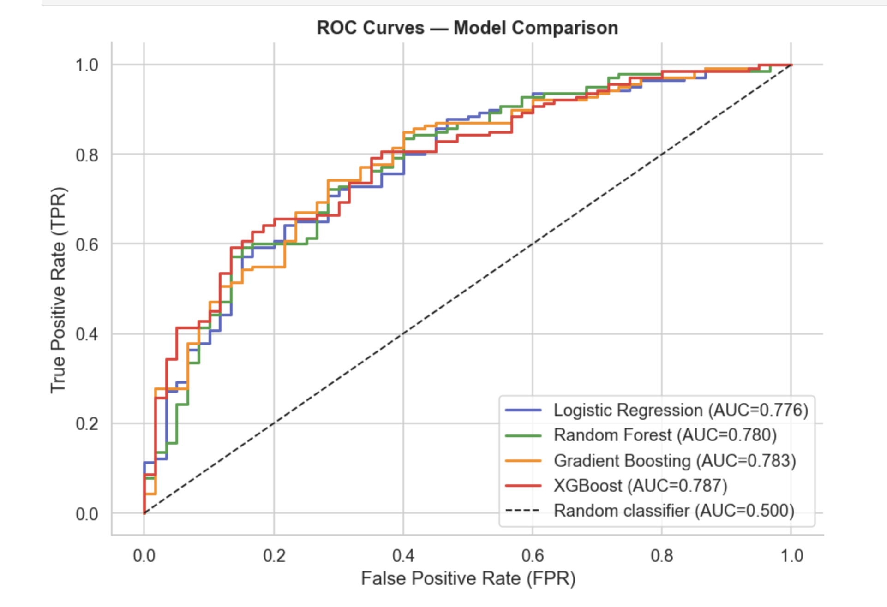
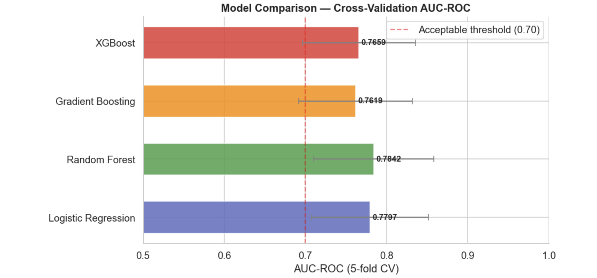
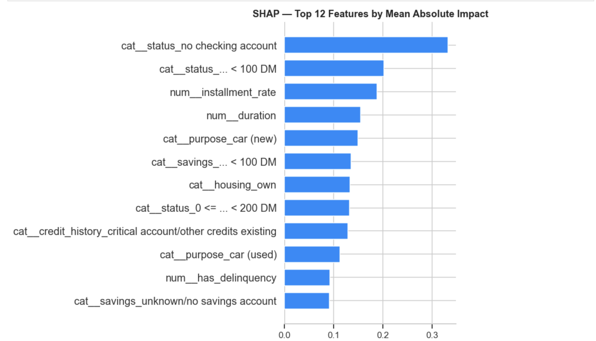
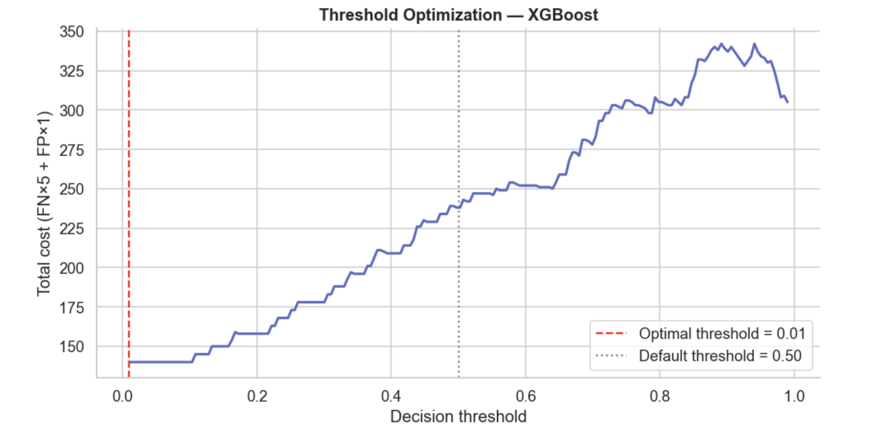

# Retail Credit Risk Probability of Default Scoring Service


A production-oriented implementation of a retail credit probability-of-default (PD) scoring service. The project benchmarks four classification algorithms on the Statlog (German Credit) dataset, selects XGBoost on the basis of held-out test performance, and serves PD estimates through a FastAPI interface together with per-applicant SHAP explanations. Outputs are structured to support the Expected Loss framework under the Basel III Internal Ratings-Based (IRB) approach: EL = PD x LGD x EAD.

## Table of Contents

- [Model Performance](#model-performance)
- [SHAP Feature Importance](#shap-feature-importance)
- [Business Interpretation of SHAP Features](#business-interpretation-of-shap-features)
- [Cost-Sensitive Threshold Optimisation](#cost-sensitive-threshold-optimisation)
- [Project Structure](#project-structure)
- [API Specification](#api-specification)
- [Feature Engineering](#feature-engineering)
- [Quick Start](#quick-start)
- [Testing](#testing)
- [Methodology](#methodology)
- [Limitations](#limitations)
- [References](#references)

## Model Performance

The model is trained on the Statlog (German Credit) dataset (Hofmann, 1994). The data comprise 1 000 obligors and 21 raw attributes with an approximate 70/30 good/bad risk split.

| Model                | AUC-ROC (5-fold CV) | AUC-ROC (test set) |
|----------------------|---------------------|--------------------|
| Logistic Regression  | 0.780               | 0.776              |
| Random Forest        | 0.784               | 0.780              |
| Gradient Boosting    | 0.762               | 0.783              |
| XGBoost (selected)   | 0.766               | 0.787              |

Gini coefficient of the selected XGBoost model: 0.574.



### Model Selection Rationale

On 5-fold cross-validation, Random Forest and Logistic Regression record marginally higher AUC than XGBoost. The differences lie within overlapping confidence intervals and are not statistically distinguishable on CV alone. XGBoost is selected because it attains the highest test-set AUC (0.787). Test-set performance is regarded as the more reliable indicator of generalisation performance for this sample size.



## SHAP Feature Importance

Global mean absolute SHAP values identify the following variables as the primary drivers of predicted default probability:

- Loan duration
- Loan amount
- Credit history category (particularly "critical account/other credits existing")
- Engineered credit history length
- Debt-to-income proxy (dti_ratio)

These findings align with established retail credit risk literature: longer exposures, larger amounts, and adverse credit behaviour increase predicted risk, while indicators of stability reduce it.



## Business Interpretation of SHAP Features

The following paragraphs translate the dominant SHAP drivers into terms used by credit risk managers and underwriters.

**Loan duration**

Longer contractual tenors raise the cumulative probability of default because the borrower remains exposed to income, employment or macroeconomic shocks for a greater number of periods. A 48-month facility will, all else equal, receive a higher PD contribution than a 12-month facility. In practice this leads to tenor caps, stepped pricing or additional security requirements for longer-maturity requests.

**Loan amount and repayment burden (dti_ratio)**

Larger absolute loan amounts increase exposure at default. The engineered dti_ratio approximates the proportion of inferred disposable income required to service the instalments. Higher values indicate stretched repayment capacity and are associated with elevated PD. Underwriters typically respond by reducing the approved amount, requiring a larger down-payment or obtaining a guarantor.

**Credit history**

The single strongest categorical signal is a "critical account/other credits existing" history. This category produces a large positive contribution to PD, reflecting observable past payment difficulties or over-indebtedness at other institutions. In contrast, a clean record ("existing credits paid back duly till now") exerts a negative (risk-reducing) effect. Credit history remains one of the most powerful and intuitive variables in retail scorecards and is frequently subject to policy overrides.

**Purpose of credit**

Loan purpose exhibits heterogeneous risk once other applicant characteristics are controlled for. Financing of used vehicles or domestic appliances tends to show higher risk contributions than new-car or furniture purchases. The difference may arise from collateral quality, borrower motivation or unobserved income characteristics. Many banks apply purpose-specific score adjustments or minimum PD floors.

**Employment stability**

Applicants reporting current employment of less than one year receive higher risk attributions. Longer tenure in the current role is associated with greater income predictability and a demonstrated ability to meet recurring obligations. Employment duration is commonly used both as a direct model input and as a manual review trigger (for example, probationary periods).

**Age and inferred credit history length**

Older applicants and those with longer derived credit histories (approximated via age and loan duration) generally attract lower PD contributions. Age serves partly as a proxy for accumulated financial experience, asset accumulation and behavioural stability. In IRB contexts this variable must be monitored for potential age discrimination effects.

**Number of delinquencies**

A binary flag derived from credit history text that indicates past delays or critical status directly increases the predicted probability of default. Because the variable is explicitly constructed and highly interpretable, it lends itself to use in override rules, second-level review and model monitoring.

Collectively these attributions allow individual credit decisions to be explained in language acceptable to model risk management, internal audit and, where required, to applicants under consumer protection regulations.

## Cost-Sensitive Threshold Optimisation

Conventional classification metrics assume symmetric misclassification costs and a default decision threshold of 0.5. In credit underwriting the economic cost of approving a borrower who subsequently defaults materially exceeds the opportunity cost of declining a creditworthy applicant. Using an illustrative 5:1 cost ratio (false negative cost five times false positive cost), the cost-minimising threshold for the XGBoost model declines to approximately 0.01. Total misclassification cost falls from 240 to 140, a reduction of 42 percent.

This result illustrates why credit risk models should be calibrated and evaluated against explicit business loss functions rather than statistical accuracy metrics alone.



## Project Structure

| File                  | Role |
|-----------------------|------|
| credit_model.py       | Core modelling logic, feature engineering, SHAP inference and serialisation |
| api.py                | FastAPI service exposing /predict, /explain and /health |
| train_model.py        | Training entry point; writes model artefact to artifacts/ |
| eda.py                | Exploratory data analysis |
| model_benchmark.py    | Model comparison across Logistic Regression, Random Forest, Gradient Boosting and XGBoost |
| analyse.py            | Supplementary analysis scripts |
| analysis.ipynb        | End-to-end notebook covering EDA, benchmarking, SHAP and threshold optimisation |
| tests/test_api.py     | API smoke, validation and monotonicity tests |
| artifacts/            | Serialised model bundle (joblib) |

The current implementation employs a curated subset of the original German Credit variables. This choice improves transparency and reduces the risk of including unstable or sparsely populated predictors while retaining the most economically relevant signals.

## API Specification

### POST /predict

Returns a point-in-time PD estimate, an internal risk band and an indicative underwriting decision.

Example request:

```bash
curl -X POST "http://localhost:8000/predict" \
  -H "Content-Type: application/json" \
  -d '{
    "duration": 24,
    "amount": 5000,
    "age": 35,
    "installment_rate": 2,
    "number_credits": 1,
    "people_liable": 1,
    "purpose": "car",
    "credit_history": "existing paid",
    "employment_duration": "1 <= ... < 4 yrs"
  }'
```

Example response:

```json
{
  "probability_default": 0.174,
  "predicted_default": false,
  "rating_grade": "low",
  "underwriting_decision": "approve"
}
```

### GET /explain?user_id=<id>

Returns the top three risk-increasing and top three risk-reducing SHAP contributions for a reference applicant. Attributions are computed with TreeSHAP on the fitted XGBoost pipeline.

Example:

```bash
curl "http://localhost:8000/explain?user_id=42"
```

Example response (feature names reflect the fitted ColumnTransformer):

```json
{
  "top_positive": [
    { "feature": "num__duration", "shap_value": 0.48 },
    { "feature": "cat__credit_history_critical account/other credits existing", "shap_value": 0.31 }
  ],
  "top_negative": [
    { "feature": "cat__employment_duration_4 <= ... < 7 years", "shap_value": -0.14 }
  ]
}
```

### GET /health

```json
{
  "status": "ok",
  "model_version": "credit-risk-20260621182137"
}
```

Interactive API documentation is available at http://localhost:8000/docs.

## Feature Engineering

The modelling pipeline applies the following transformations to the raw data:

| Feature                  | Description |
|--------------------------|-------------|
| dti_ratio                | Loan amount divided by a proxy for disposable income constructed from installment_rate and employment_length |
| credit_history_length    | Age-based proxy for length of credit history, adjusted by loan duration |
| number_of_delinquencies  | Binary indicator derived from text fields indicating past delays or critical status |
| employment_length        | Ordinal mapping of employment duration bands into approximate years |
| loan_purpose             | Passthrough of purpose for one-hot encoding |

All numeric features are median-imputed and standardised; categorical features are mode-imputed and one-hot encoded.

## Quick Start

### 1. Environment

```bash
python3 -m venv .venv
source .venv/bin/activate
pip install -r requirements.txt
```

### 2. Train the model

```bash
python3 train_model.py
```

The command fits the pipeline on the training partition, evaluates on the hold-out set and writes the serialised artefact to `artifacts/credit_risk_model.joblib`.

### 3. Start the service

```bash
uvicorn api:app --reload --port 8000
```

### 4. Verify with curl

Health check:

```bash
curl http://localhost:8000/health
```

Score an applicant:

```bash
curl -X POST "http://localhost:8000/predict" \
  -H "Content-Type: application/json" \
  -d '{
    "duration": 36,
    "amount": 8000,
    "age": 42,
    "installment_rate": 3,
    "number_credits": 2,
    "people_liable": 1,
    "purpose": "furniture/equipment",
    "credit_history": "existing paid",
    "employment_duration": ">= 7 yrs"
  }'
```

Retrieve explanation for a reference observation:

```bash
curl "http://localhost:8000/explain?user_id=0"
```

## Testing

```bash
pytest
```

The test suite validates endpoint responses, input sanitisation and a basic monotonicity property (higher inferred income should not materially increase predicted PD).

## Methodology

- Validation: stratified 80/20 train/test split; 5-fold cross-validation for model comparison.
- Primary metric: Area Under the Receiver Operating Characteristic Curve (AUC-ROC). Gini coefficient reported as 2 x AUC - 1.
- Explainability: TreeSHAP applied to the final XGBoost classifier for both local and global attributions.
- Decision threshold: optimised explicitly under an asymmetric cost function rather than using the conventional 0.5 cutoff.

## Limitations

- Sample size is modest (1 000 observations). Cross-validation intervals are consequently wide and model rankings should be treated with appropriate caution.
- Income is not directly observed and is proxied from installment rate and employment duration.
- The model contains no macroeconomic or point-in-time factors and therefore produces through-the-cycle rather than point-in-time PD estimates.
- No automated monitoring of Population Stability Index (PSI) or characteristic drift is implemented.
- The 5:1 cost ratio used for threshold optimisation is illustrative. A production implementation would calibrate loss-given-default and lost-revenue parameters to the bank's actual portfolio experience.
- The service constitutes a proof-of-concept and has not been independently validated for regulatory capital purposes.

## References

- Hofmann, H. (1994). Statlog (German Credit Data). UCI Machine Learning Repository.
- Basel Committee on Banking Supervision (2017). Basel III: Finalising post-crisis reforms.
