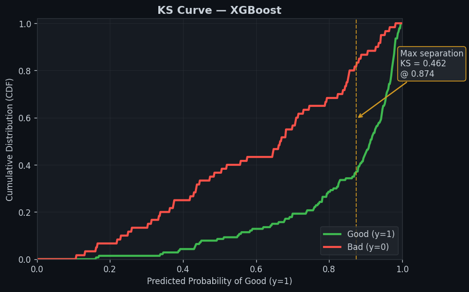

# Retail Credit Risk Probability of Default Scoring Service


A production-oriented implementation of a retail credit probability-of-default (PD) scoring service. The project benchmarks four classification algorithms on the Statlog (German Credit) dataset, selects XGBoost on the basis of held-out test performance, and serves PD estimates through a FastAPI interface together with per-applicant SHAP explanations. Outputs are structured to support the Expected Loss framework under the Basel III Internal Ratings-Based (IRB) approach: EL = PD x LGD x EAD.

## Table of Contents

- [Model Performance](#model-performance)
- [SHAP Feature Importance](#shap-feature-importance)
- [Business Interpretation of SHAP Features](#business-interpretation-of-shap-features)
- [Cost-Sensitive Threshold Optimisation](#cost-sensitive-threshold-optimisation)
- [Project Structure](#project-structure)
- [API Specification](#api-specification)
- [Feature Engineering](#feature-engineering)
- [Quick Start](#quick-start)
- [Testing](#testing)
- [Methodology](#methodology)
- [Limitations](#limitations)
- [References](#references)

## Model Performance

The model is trained on the Statlog (German Credit) dataset (Hofmann, 1994). The data comprise 1 000 obligors and 21 raw attributes with an approximate 70/30 good/bad risk split.

| Model                | AUC-ROC (5-fold CV) | AUC-ROC (test set) | KS Statistic |
|----------------------|---------------------|--------------------|--------------|
| Logistic Regression  | 0.780               | 0.776              | —            |
| Random Forest        | 0.784               | 0.780              | —            |
| Gradient Boosting    | 0.762               | 0.783              | —            |
| XGBoost (selected)   | 0.766               | 0.787              | 0.462        |

Gini coefficient of the selected XGBoost model: 0.574.

KS statistic of the selected XGBoost model: 0.462.

The KS statistic of 0.462 falls in the good range (0.40–0.60), indicating strong separation between the predicted probability distributions of good and bad applicants. This confirms that the model ranks defaulters and non-defaulters effectively on the held-out test data.




### Model Selection Rationale

On 5-fold cross-validation, Random Forest and Logistic Regression record marginally higher AUC than XGBoost. The differences lie within overlapping confidence intervals and are not statistically distinguishable on CV alone. XGBoost is selected because it attains the highest test-set AUC (0.787). Test-set performance is regarded as the more reliable indicator of generalisation performance for this sample size.


## SHAP Feature Importance

Global mean absolute SHAP values identify the following variables as the strongest drivers of predicted probability of default:

- cat__status_no checking account (strongest)
- cat__status_... < 100 DM
- num__installment_rate
- num__duration
- cat__purpose_car (new)
- cat__savings_... < 100 DM
- cat__housing_own

These findings are consistent with standard retail credit risk practice, where checking account status and balances, repayment burden and loan duration are among the most predictive signals of default.


## Business Interpretation of SHAP Features

Global mean absolute SHAP values from the model identify the following variables as the strongest drivers of predicted probability of default:

- cat__status_no checking account
- cat__status_... < 100 DM
- num__installment_rate
- num__duration
- cat__purpose_car (new)
- cat__savings_... < 100 DM
- cat__housing_own

These attributions reflect observable characteristics routinely used in retail credit assessment.

**Checking account status: no checking account**

Absence of a checking account is the single most powerful risk-increasing factor. It indicates that the applicant has no established banking relationship with the institution and provides no observable transaction history or cash-flow behaviour. This creates significant information asymmetry and adverse selection risk. In practice, applicants in this category receive materially higher PD estimates and are more likely to be subject to manual review or stricter policy overlays.

**Checking account status: ... < 100 DM**

Low or minimal balances in the checking account signal limited immediate liquidity. Borrowers who maintain persistently low account balances have reduced capacity to meet even modest short-term obligations without drawing on other resources. This variable ranks highly because it captures a contemporaneous and granular indicator of financial stress that is directly relevant to repayment probability.

**Instalment rate**

A higher instalment rate relative to disposable income increases the proportion of monthly cash flow already committed to debt service. When instalments represent a large share of income, the borrower has less margin to absorb income volatility, expense shocks or changes in employment status. Credit officers use this attribute to assess affordability and to determine whether the requested loan amount is sustainable.

**Loan duration**

Longer loan terms extend the period over which default can materialise. All else equal, a facility with a 48-month tenor carries greater cumulative risk than one with a 12-month tenor because the borrower remains exposed to employment, health and macroeconomic events for a longer horizon. This consideration typically informs maximum tenor limits and maturity-based adjustments in pricing and capital allocation.

**Purpose: car (new)**

New-car financing features among the top contributors to the PD prediction. The direction of the effect often reflects the presence of tangible collateral (the vehicle) and a tendency for this purpose to be associated with more stable borrower profiles. Banks commonly apply differentiated treatment by loan purpose, using it both within scorecards and in policy rules to set purpose-specific cut-offs or pricing.

**Savings balance: ... < 100 DM**

Very low savings balances indicate limited accumulated reserves available to cushion against unexpected events. Applicants with minimal savings have lower financial resilience and are more vulnerable to temporary income shortfalls. This factor is particularly material for unsecured lending products where recovery relies primarily on the borrower's ongoing repayment capacity rather than collateral.

**Housing status: own**

Home ownership is typically a protective factor. Ownership is associated with greater financial stability, wealth accumulation and a lower propensity for mobility-related or strategic default. In credit decisioning, home ownership often supports more favourable risk assessment, both through the model output and through explicit policy treatment that may permit higher loan-to-value ratios or improved pricing for qualifying applicants.

These SHAP attributions enable individual credit decisions to be explained to model risk management, internal audit and, where relevant, to applicants in terms of standard retail lending variables. They also support ongoing model monitoring and the identification of segments where policy overlays may be warranted.

## Cost-Sensitive Threshold Optimisation

Conventional classification metrics assume symmetric misclassification costs and a default decision threshold of 0.5. In credit underwriting the economic cost of approving a borrower who subsequently defaults materially exceeds the opportunity cost of declining a creditworthy applicant. Using an illustrative 5:1 cost ratio (false negative cost five times false positive cost), the cost-minimising threshold for the XGBoost model declines to approximately 0.01. Total misclassification cost falls from 240 to 140, a reduction of 42 percent.

This result illustrates why credit risk models should be calibrated and evaluated against explicit business loss functions rather than statistical accuracy metrics alone.


## Project Structure

| File                  | Role |
|-----------------------|------|
| credit_model.py       | Core modelling logic, feature engineering, SHAP inference and serialisation |
| api.py                | FastAPI service exposing /predict, /explain and /health |
| train_model.py        | Training entry point; writes model artefact to artifacts/ |
| eda.py                | Exploratory data analysis |
| model_benchmark.py    | Model comparison across Logistic Regression, Random Forest, Gradient Boosting and XGBoost |
| analyse.py            | Supplementary analysis scripts |
| analysis.ipynb        | End-to-end notebook covering EDA, benchmarking, SHAP and threshold optimisation |
| tests/test_api.py     | API smoke, validation and monotonicity tests |
| artifacts/            | Serialised model bundle (joblib) |

The current implementation employs a curated subset of the original German Credit variables. This choice improves transparency and reduces the risk of including unstable or sparsely populated predictors while retaining the most economically relevant signals.

## API Specification

### POST /predict

Returns a point-in-time PD estimate, an internal risk band and an indicative underwriting decision.

Example request:

```bash
curl -X POST "http://localhost:8000/predict" \
  -H "Content-Type: application/json" \
  -d '{
    "duration": 24,
    "amount": 5000,
    "age": 35,
    "installment_rate": 2,
    "number_credits": 1,
    "people_liable": 1,
    "purpose": "car",
    "credit_history": "existing paid",
    "employment_duration": "1 <= ... < 4 yrs"
  }'
```

Example response:

```json
{
  "probability_default": 0.174,
  "predicted_default": false,
  "rating_grade": "low",
  "underwriting_decision": "approve"
}
```

### GET /explain?user_id=<id>

Returns the top three risk-increasing and top three risk-reducing SHAP contributions for a reference applicant. Attributions are computed with TreeSHAP on the fitted XGBoost pipeline.

Example:

```bash
curl "http://localhost:8000/explain?user_id=42"
```

Example response (feature names reflect the fitted ColumnTransformer):

```json
{
  "top_positive": [
    { "feature": "num__duration", "shap_value": 0.48 },
    { "feature": "cat__credit_history_critical account/other credits existing", "shap_value": 0.31 }
  ],
  "top_negative": [
    { "feature": "cat__employment_duration_4 <= ... < 7 years", "shap_value": -0.14 }
  ]
}
```

### GET /health

```json
{
  "status": "ok",
  "model_version": "credit-risk-20260621182137"
}
```

Interactive API documentation is available at http://localhost:8000/docs.

## Feature Engineering

The modelling pipeline applies the following transformations to the raw data:

| Feature                  | Description |
|--------------------------|-------------|
| dti_ratio                | Loan amount divided by a proxy for disposable income constructed from installment_rate and employment_length |
| credit_history_length    | Age-based proxy for length of credit history, adjusted by loan duration |
| number_of_delinquencies  | Binary indicator derived from text fields indicating past delays or critical status |
| employment_length        | Ordinal mapping of employment duration bands into approximate years |
| loan_purpose             | Passthrough of purpose for one-hot encoding |

All numeric features are median-imputed and standardised; categorical features are mode-imputed and one-hot encoded.

## Quick Start

### 1. Environment

```bash
python3 -m venv .venv
source .venv/bin/activate
pip install -r requirements.txt
```

### 2. Train the model

```bash
python3 train_model.py
```

The command fits the pipeline on the training partition, evaluates on the hold-out set and writes the serialised artefact to `artifacts/credit_risk_model.joblib`.

### 3. Start the service

```bash
uvicorn api:app --reload --port 8000
```

### 4. Verify with curl

Health check:

```bash
curl http://localhost:8000/health
```

Score an applicant:

```bash
curl -X POST "http://localhost:8000/predict" \
  -H "Content-Type: application/json" \
  -d '{
    "duration": 36,
    "amount": 8000,
    "age": 42,
    "installment_rate": 3,
    "number_credits": 2,
    "people_liable": 1,
    "purpose": "furniture/equipment",
    "credit_history": "existing paid",
    "employment_duration": ">= 7 yrs"
  }'
```

Retrieve explanation for a reference observation:

```bash
curl "http://localhost:8000/explain?user_id=0"
```

## Testing

```bash
pytest
```

The test suite validates endpoint responses, input sanitisation and a basic monotonicity property (higher inferred income should not materially increase predicted PD).

## Methodology

- Validation: stratified 80/20 train/test split; 5-fold cross-validation for model comparison.
- Primary metric: Area Under the Receiver Operating Characteristic Curve (AUC-ROC). Gini coefficient reported as 2 x AUC - 1. KS statistic (via `scipy.stats.ks_2samp`) reported as the maximum separation between the empirical CDFs of predicted probabilities for the good and bad classes.
- Explainability: TreeSHAP applied to the final XGBoost classifier for both local and global attributions.
- Decision threshold: optimised explicitly under an asymmetric cost function rather than using the conventional 0.5 cutoff.

## Limitations

- Sample size is modest (1 000 observations). Cross-validation intervals are consequently wide and model rankings should be treated with appropriate caution.
- Income is not directly observed and is proxied from installment rate and employment duration.
- The model contains no macroeconomic or point-in-time factors and therefore produces through-the-cycle rather than point-in-time PD estimates.
- No automated monitoring of Population Stability Index (PSI) or characteristic drift is implemented.
- The 5:1 cost ratio used for threshold optimisation is illustrative. A production implementation would calibrate loss-given-default and lost-revenue parameters to the bank's actual portfolio experience.
- The service constitutes a proof-of-concept and has not been independently validated for regulatory capital purposes.

## References

- Hofmann, H. (1994). Statlog (German Credit Data). UCI Machine Learning Repository.
- Basel Committee on Banking Supervision (2017). Basel III: Finalising post-crisis reforms.
