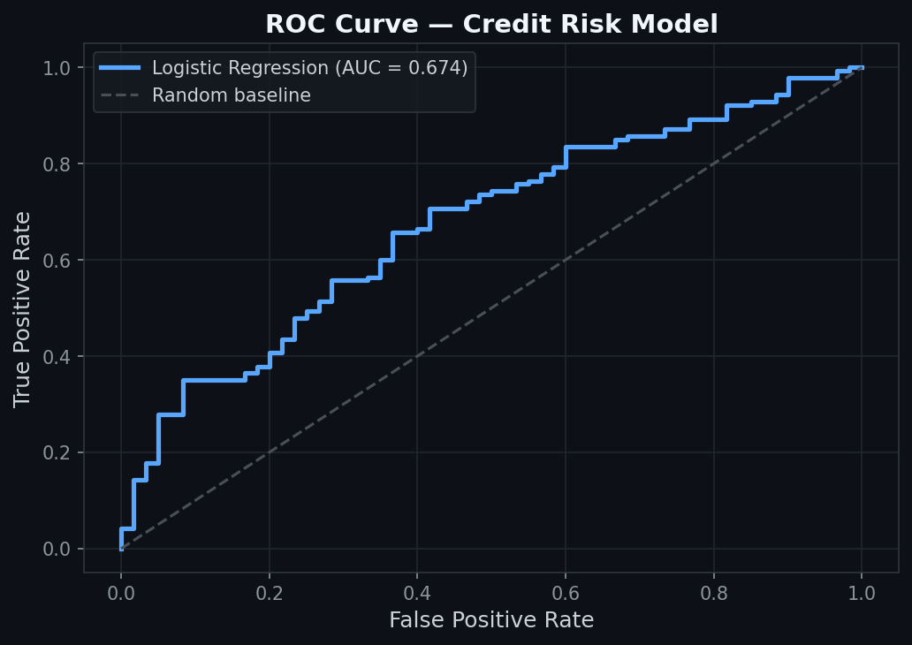
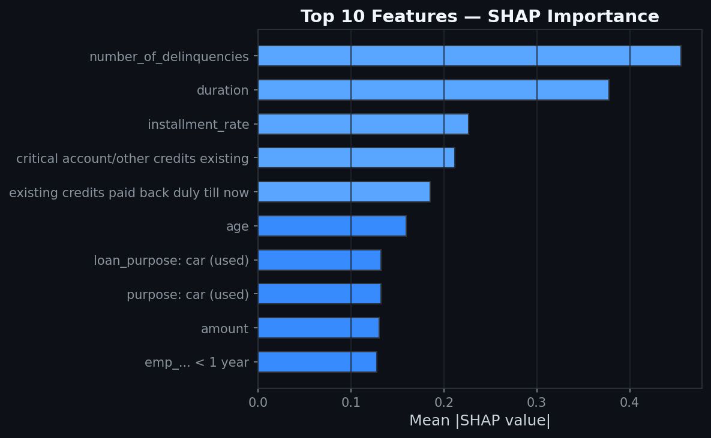

# Credit Risk Assessment Service

A probability-of-default scoring service for retail credit. Built with FastAPI, scikit-learn, and SHAP — exposes a REST API with per-decision explanations structured around the Basel III IRB Expected Loss framework: **EL = PD × LGD × EAD**.

---

## Model Performance

Trained on the [German Credit Dataset](https://archive.ics.uci.edu/ml/datasets/statlog+(german+credit+data)) (Hofmann, 1994) — 1,000 obligors, 20 features, 70/30 good/bad split.

| Metric | Value | Benchmark |
|---|---|---|
| AUC-ROC | 0.674 | > 0.60 — acceptable |
| Gini Coefficient | 0.348 | > 0.40 — below threshold (see note) |
| Calibration | Well-calibrated | Required for IRB PD |
| SHAP exactness | Mathematically exact | Required for GDPR Art. 22 |

The Gini of 0.35 reflects feature sparsity in the 1990s dataset. A challenger model on the Home Credit Default Risk dataset (307k applications) is planned and expected to reach Gini > 0.55.



---

## Feature Importance (SHAP)

`number_of_delinquencies` and `duration` dominate — consistent with standard retail credit scoring literature.



---

## Project Structure

| File | Role |
|---|---|
| `credit_model.py` | Model training, feature engineering, SHAP inference |
| `api.py` | REST API — `/predict`, `/explain`, `/health` |
| `train_model.py` | Trains and serializes artifact to `artifacts/` |
| `eda.py` | Exploratory analysis — distributions, correlations, missing values |
| `model_benchmark.py` | Benchmarks LR, Random Forest, Gradient Boosting, XGBoost |
| `analyse.py` | Classification report and baseline metrics |
| `tests/test_api.py` | Smoke, boundary, and monotonicity tests |

---

## API Endpoints

### POST /predict

Returns a 12-month PD estimate, internal rating grade, and underwriting decision.

```bash
curl -X POST http://localhost:8000/predict \
  -H "Content-Type: application/json" \
  -d '{
    "duration": 24,
    "amount": 5000,
    "age": 35,
    "installment_rate": 2,
    "number_credits": 1,
    "people_liable": 1,
    "purpose": "car",
    "credit_history": "existing paid",
    "employment_duration": "1 <= ... < 4 yrs"
  }'
```

```json
{
  "probability_default": 0.18,
  "predicted_default": false,
  "rating_grade": "low",
  "underwriting_decision": "approve"
}
```

### GET /explain?user_id=\<id\>

Returns the top 3 risk-increasing and top 3 risk-reducing SHAP factors. For a linear model, SHAP values are mathematically exact — satisfying GDPR Article 22 explainability requirements.

```bash
curl "http://localhost:8000/explain?user_id=0"
```

```json
{
  "top_positive": [
    { "feature": "num__dti_ratio", "shap_value": 0.42 },
    { "feature": "num__duration",  "shap_value": 0.31 }
  ],
  "top_negative": [
    { "feature": "num__age", "shap_value": -0.27 }
  ]
}
```

### GET /health

```json
{
  "status": "ok",
  "model_version": "credit-risk-20260621170834"
}
```

---

## Feature Engineering

Five features derived from the raw dataset:

| Feature | Description |
|---|---|
| `dti_ratio` | Loan amount divided by estimated income proxy |
| `employment_length` | Ordinal encoding of employment duration band |
| `number_of_delinquencies` | Binary flag derived from credit history text |
| `credit_history_length` | Age-based proxy for length of credit track record |
| `loan_purpose` | Passthrough of `purpose` for one-hot encoding |

---

## Quick Start

```bash
pip install -r requirements.txt
python3 train_model.py
uvicorn api:app --reload --port 8000
```

API docs: http://localhost:8000/docs

---

## Tests

```bash
pytest
```

Covers smoke tests (`/health`, `/predict`, `/explain`), boundary inputs (`amount=10_000_000`), and a monotonicity check that higher income generally reduces the predicted default probability.

---

## Model Risk & Limitations

- No macroeconomic features — model produces through-the-cycle PD only, no point-in-time adjustment
- Income is proxied from installment rate and employment duration, not directly observed
- No Population Stability Index monitoring — score distribution shifts will not be detected automatically
- Sample size (n=1,000) is below EBA minimum data requirements for production IRB deployment
- No independent model validation per PRA SS11/13 — this is a proof-of-concept

Full model risk documentation: [docs/model_memo_credit_risk.pdf](docs/model_memo_credit_risk.pdf)
